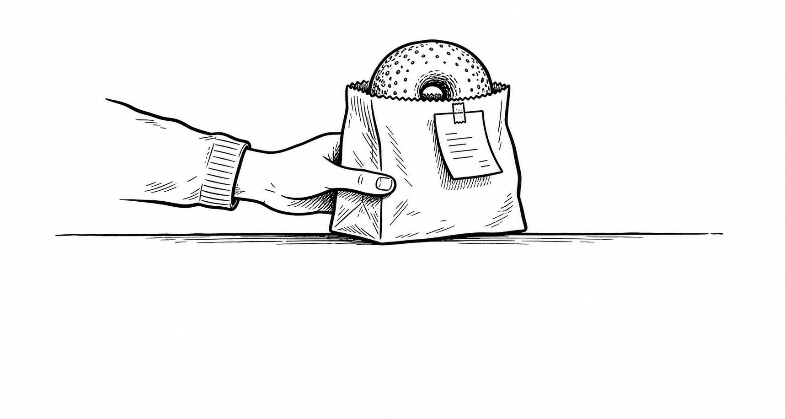
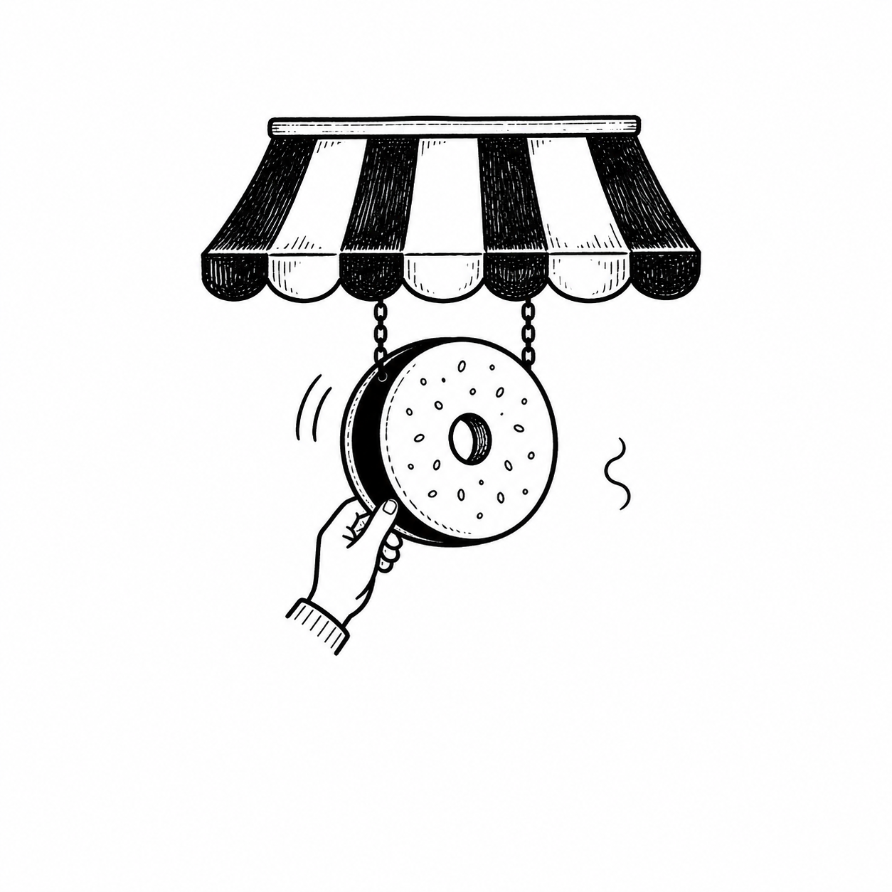
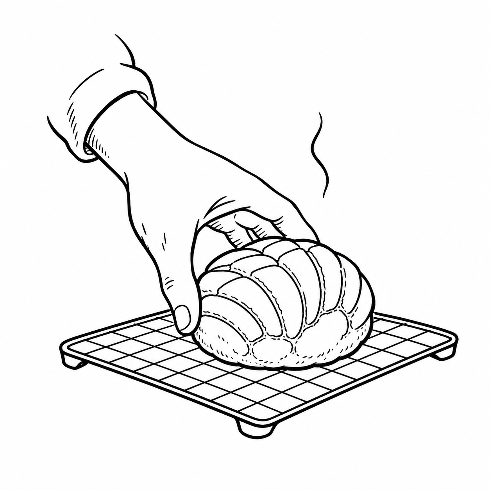

# Monochrome Branding

## Operating brief

Before starting or revising a portfolio project, read [BRAND_IDENTITY_WORKFLOW.md](./BRAND_IDENTITY_WORKFLOW.md) in full. It defines the studio signature, the five-deliverable sequence, and the rule that the primary illustration must remain consistent across applications and motion.

`Assets/01_Approved_Illustrations/` contains the approved illustration masters. `Assets/02_Logo_Explorations/` contains the studies used to understand their visual logic. `Assets/03_Brand_Projects/` contains working project assets, including motion builds.

## Non-negotiable: use rendered raster illustration for the primary mark

The approved primary illustrations in `Assets/01_Approved_Illustrations/` are OpenAI `gpt-image` v2 raster renders. Their embedded C2PA Content Credentials identify the OpenAI Media Service API as the source. They are the quality and production reference for future primary marks.

**Do not build, trace, or substitute the primary illustration with hand-coded SVG paths.** A primary mark must begin as an original rendered or manually drawn ink illustration, then be selected and refined as a high-resolution PNG. SVG is allowed only after that stage for a deliberately reduced utility asset (for example, a small icon, stamp, or reverse mark); it is never a substitute for the expressive primary illustration.

`Assets/02_Logo_Explorations/02_Rebuilt_Studies/` contains only exploratory rendered PNG studies. It is not a source for coded primary marks.

## Start here: rendered logo library

These are the actual approved raster illustrations, not placeholders. Use them as the source artwork whenever a logo is shown in a case-study page, a mockup, or motion. Do not ask an image model to redraw the logo, wordmark, or readable copy.

| Illustration | Approved master | Core ritual |
| --- | --- | --- |
| Bagel Handoff | [PNG](./Assets/01_Approved_Illustrations/fnb-logo-01-bagel-handoff.png) | A hand passes a bagel in its paper bag. |
| Open for Bagels | [PNG](./Assets/01_Approved_Illustrations/fnb-logo-02-open-for-bagels.png) | A hand turns the opening sign. |
| Concha Cooling | [PNG](./Assets/01_Approved_Illustrations/fnb-logo-02-concha-cooling.png) | A concha cools on a rack. |

  
  
  

## How to craft a new illustrated logo

This is the repeatable production path behind the rendered work above.

1. **Write the ritual in one sentence.** Use: `A [hand/person/tool] [one verb] a [hero object] at/with a [business cue].` Example: “A hand turns a bagel opening sign beneath an awning.”
2. **Lock the three things that must read instantly:** one hero object, one action, and one business cue. If a viewer needs a second sentence to understand the mark, reduce the idea.
3. **Make two or three monochrome studies.** Change only crop, angle, or pose. Keep the same ritual so the comparison tests clarity rather than inventing new concepts.
4. **Choose the fastest three-second read, then simplify it.** Build the silhouette in black first. Remove background detail, extra props, and texture before adding selective interior ink detail.
5. **Create the approved master.** Generate or draw the full ink illustration as a high-resolution PNG in `Assets/01_Approved_Illustrations/`; record exploratory raster variants in `Assets/02_Logo_Explorations/`. Do not replace this step with SVG paths. Make a reduced mark only if the silhouette still works at small size.
6. **Apply, don’t regenerate.** Once a primary illustration is approved, use that exact PNG in the hero environment, packaging, and logo page. `gpt-image` may be used to create and compare new primary-illustration candidates during Steps 3–5, but never ask it to reproduce an already approved mark, wordmark, or legible brand copy.
7. **Prove continuity.** Deliverable 04 isolates this exact mark. Deliverable 05 animates the same hero, action, composition, and visual world—never a second logo concept.

For the detailed gates, prompts, portfolio order, and motion handoff, follow [BRAND_IDENTITY_WORKFLOW.md](./BRAND_IDENTITY_WORKFLOW.md).

## Final Bagel Portfolio — reference sequence

`Final Bagel Portfolio/` is the visual reference for how a completed Monochrome case study is presented. Its filenames describe the sequence; they do **not** all describe the production method.

| File | What it actually is | Role in the sequence |
| --- | --- | --- |
| `01-opening-storyboard.png` | One static editorial opening frame: headline and short positioning copy on the left, a photoreal storefront scene on the right. Despite its filename, it is not a multi-frame storyboard. | Establish the brand in the world before explaining it. |
| `02-brand-identity-description.png` | Brand-name, rationale, palette, and a small opening-sign illustration on a calm paper field. | Explain the identity system. |
| `03-storefront-and-sticker-set.png` | A hybrid brand-world board: line-drawn storefront illustration at left; product/sticker-style bagel cut-outs at right. | Show the practical brand world and applications. |
| `04-core-logo-illustration.png` | The isolated **Open for Bagels** opening-sign illustration on white. | Let the core mark stand alone. |
| `05-bagel-storyboard.mp4` | An 11.1-second, 1080 × 1080 Bagel Handoff motion study. | Show a living illustrated asset. |

### What can and cannot be inferred from Bagel

- The final folder contains only flattened deliverables. There are no editable source files, layout files, prompts, or build scripts for slides 01–03, so their exact authoring tool and whether any individual visual came from GPT Image cannot be proven from this workspace.
- Slide 01 visibly combines direct typography with a photorealistic storefront image. Slide 03 visibly combines a drawn storefront with isolated product imagery. Treat these as controlled composites, not as evidence that generated text or logos should be trusted.
- The motion build *is* traceable in `Assets/03_Brand_Projects/bagel-brand/03_Motion_Assets/`, with keyframes, layers, render scripts, prototypes, and exports.
- `05-bagel-storyboard.mp4` is the exported whiteboard animation for **Open for Bagels**. Its source scene, annotation, preview, and SRT live in `Assets/03_Brand_Projects/bagel-brand/03_Motion_Assets/whiteboard-source/open-for-bagels/`. The originating workflow is [geeklee/srt-whiteboard-animation](https://github.com/geeklee/srt-whiteboard-animation): an SRT-driven, region-annotated whiteboard renderer. Treat this repository as the canonical reference if the motion needs to be recreated or extended.
- Bagel's final 04 and 05 are continuous: both use **Open for Bagels**. The separate `bagel-handoff-motion` working renders are useful experiments, but they are not the video in the final portfolio folder.

## Required pattern for all future projects

Use the Bagel sequence as a **presentation reference** and `BRAND_IDENTITY_WORKFLOW.md` as the **production rule**.

1. **01 — The Opening:** one static editorial opening frame. Use the Bagel split composition when it suits the concept: headline/copy on one side, a believable real-world hero scene on the other.
2. **02 — Brand Identity:** name, concise positioning, palette/type direction, and the primary illustration or an intentional supporting crop.
3. **03 — Storefront illustration + application set:** one illustrated operating environment plus the category-appropriate product, packaging, menu, or sticker system. It can be a hybrid board like Bagel's, but must be specific to the business.
4. **04 — Core illustration:** the approved primary mark, isolated on its quietest field.
5. **05 — Motion study:** animate the *same primary illustration and ritual* used for 04. Do not repeat Bagel's legacy mismatch.

For generated environments or food photography, create only the context with image generation. Apply approved identity artwork, wordmarks, and readable copy directly in the final composition.

## Current Gimbap Roll status

- Approved direction: the core Gimbap Roll illustration must anchor every portfolio page; the **Seaweed & Chilli** moodboard establishes its supporting world.
- Existing motion: a four-keyframe Gimbap Roll prototype and its production handoff under `Assets/03_Brand_Projects/gimbap-roll/03_Motion_Assets/`.
- Current files for review: the logo-first 02 identity page and `moodboard.png` in `Final - Gimbap Roll/`.
- Rejected drafts: the current 01 and 03 files do not yet give the approved rolling illustration sufficient prominence. Rebuild them around the same logo-first rule before continuing to 04 and 05.

## Illustration foundation

The four core food-logo studies are:

1. Bagel Handoff — a service handoff with a paper-bag silhouette.
2. Gimbap Roll — a food-first rolling gesture.
3. Concha Cooling — a single product placed on a cooling rack.
4. Open for Bagels — a hand turning an opening sign below an awning.

Follow [design.md](./design.md) when building or reducing an illustration: one hero, one action, one business cue; then subtract detail before adding it.
